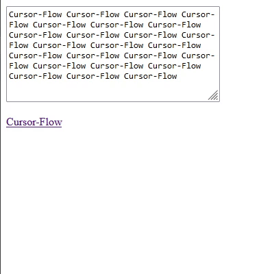

# Cursor-Flow

Cursor-Flow rotates your cursor based on the direction the cursor is moving.




## Usage

Just add those two lines:

```html
<link rel="stylesheet" href="Cursor-Flow.css">
<script src="Cursor-Flow.js"></script>
```

And make sure the images can be found.

## Notes

The file `Cursor-Flow.css` lists a lot of selectors like:
```css
.CF-cursor.zoom-in {
    background-image: url('images/default_32x32.png');
}
```

Those are not implemented right now and neihter am I planning on implementing those due to how bad the API for the web is. For real, who is in charge?

Currently the only ones being implemented are: `pointer`, `text` and `default`.


## Lists of sites that implement it

I hope this lists get's longer over time :)

- 


<!-- 

For making a bookmark to test it on any page:

```js
javascript:(function() {
  console.log("ok");
  var script = document.createElement('script');
  script.src = 'http://localhost:8000/pointer.js';
  document.body.appendChild(script);

  var styles = document.createElement('link');
  styles.rel = 'stylesheet';
  styles.type = 'text/css';
  styles.href = 'http://localhost:8000/pointer-styles.css';
  document.head.appendChild(styles);
})()
``` -->
